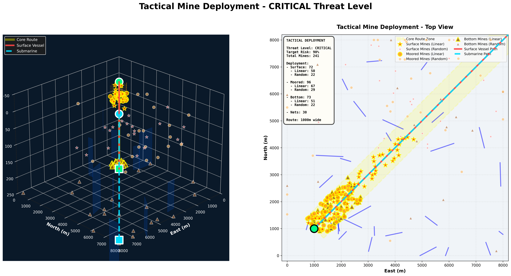
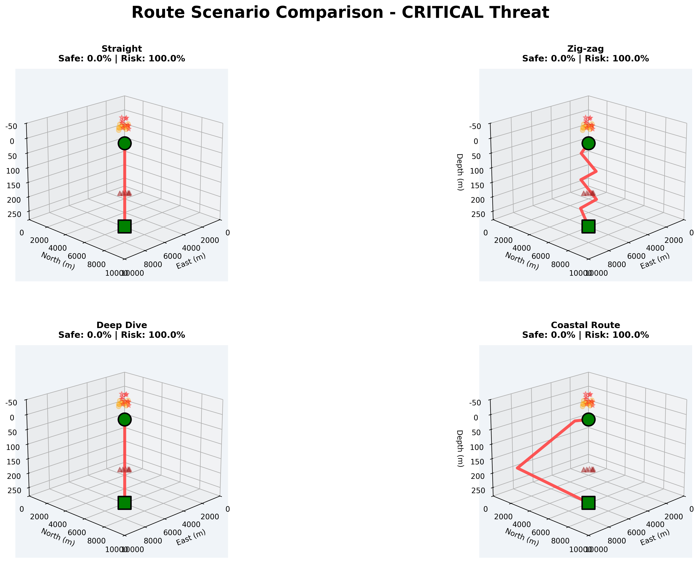

# Naval Mine Warfare Simulator 🚢⚓


**A comprehensive 3D tactical mine field simulation and risk analysis system for naval operations. This simulator provides advanced modeling of mine warfare scenarios, enabling tactical analysis for both surface vessels and submarines.**





## Overview

The Naval Mine Warfare Simulator is a Python-based tactical simulation system designed for:

- **Military Planning**: Tactical mine deployment strategy analysis
- **Risk Assessment**: Statistical evaluation of mine field effectiveness
- **Route Optimization**: Safe passage route identification through hostile waters
- **Training & Education**: Naval warfare doctrine and mine countermeasure training
- **Research**: Academic research in naval tactics and autonomous navigation

The simulator uses Monte Carlo methods to provide statistical confidence in risk assessments across thousands of iterations.

---

## Key Features

### Simulation Capabilities
- ✅ **3D Mine Field Deployment** - Realistic tactical mine placement with linear and random strategies
- ✅ **Multi-Type Mines** - Surface mines, moored mines, and bottom mines
- ✅ **3D Net Obstacles** - Subsurface net barriers (닻자망)
- ✅ **Dual-Mode Analysis** - Both surface vessel (2D) and submarine (3D) path evaluation
- ✅ **Monte Carlo Simulation** - Statistical risk analysis with configurable iteration counts

### Tactical Features
- ✅ **Multiple Threat Levels** - MODERATE, HIGH, CRITICAL scenarios
- ✅ **Route Scenarios** - Direct, Zigzag, Deep Dive, Coastal route strategies
- ✅ **Collision Detection** - Precise 3D collision detection algorithms
- ✅ **Tactical Deployment Patterns** - Linear barrier formation + random field distribution

### Analysis & Visualization
- ✅ **Comprehensive Statistics** - Mine hits, net hits, combined hits, safe transit rates
- ✅ **Scenario Comparison** - Side-by-side route strategy evaluation
- ✅ **Visual Dashboards** - 3D mine field visualizations and tactical analysis charts
- ✅ **JSON Export** - Detailed results in machine-readable format

---

## Installation

### Prerequisites

- Python 3.8 or higher
- pip package manager

### Install from Source

```bash
# Clone the repository
git clone https://github.com/Navy10021/naval_simulator.git
cd naval_simulator

# Install dependencies
pip install -r requirements.txt
```

### Dependencies

```
numpy>=1.21.0       # Numerical computing
matplotlib>=3.4.0   # Visualization
scipy>=1.7.0        # Scientific computing
```

### Verify Installation

```bash
# Run quick test
python examples/quick_test.py
```

---

## Quick Start

### Run Basic Simulation

```bash
# Run with default HIGH threat level
python examples/basic_simulation.py

# Results will be saved in ./output/
```

### Run Scenario Comparison

```bash
# Compare multiple route strategies
python examples/scenario_comparison.py
```

### Expected Output

```
================================================================
                 TACTICAL MINE SIMULATION
================================================================
Threat Level: HIGH
Total Mines: 300 (Surface: 90, Moored: 120, Bottom: 90)
Nets: 30
================================================================

Running 1000 simulations...
Progress: 100.0% (1000/1000)

Results:
Surface Vessel:
  Total Risk:    72.5%
  Safe Transit:  27.5%
  Mine Hits:     68.2%
  Net Hits:       4.3%

Submarine:
  Total Risk:    45.3%
  Safe Transit:  54.7%
  Mine Hits:     41.8%
  Net Hits:       3.5%
```

---

## Architecture

### System Architecture

```
┌─────────────────────────────────────────────────────────┐
│                   User Interface                        │
│          (Examples / Jupyter Notebooks)                 │
└────────────────────┬────────────────────────────────────┘
                     │
┌────────────────────▼────────────────────────────────────┐
│              Tactical Mine Simulation                   │
│  ┌──────────────────────────────────────────────────┐   │
│  │  Mine Deployment Engine                          │   │
│  │  - Linear deployment along core route            │   │
│  │  - Random field distribution                     │   │
│  └──────────────────────────────────────────────────┘   │
│  ┌──────────────────────────────────────────────────┐   │
│  │  Path Generation                                 │   │
│  │  - 2D surface vessel paths                       │   │
│  │  - 3D submarine paths                            │   │
│  │  - Route scenario strategies                     │   │
│  └──────────────────────────────────────────────────┘   │
│  ┌──────────────────────────────────────────────────┐   │
│  │  Collision Detection                             │   │
│  │  - Mine collision (2D/3D)                        │   │
│  │  - Net collision (2D/3D)                         │   │
│  └──────────────────────────────────────────────────┘   │
└────────────────────┬────────────────────────────────────┘
                     │
┌────────────────────▼────────────────────────────────────┐
│                Mine Objects Layer                       │
│  ┌──────────┐  ┌──────────┐  ┌──────────┐  ┌────────┐   │
│  │ Surface  │  │ Moored   │  │ Bottom   │  │  Net   │   │
│  │  Mine    │  │  Mine    │  │  Mine    │  │  3D    │   │
│  └──────────┘  └──────────┘  └──────────┘  └────────┘   │
└────────────────────┬────────────────────────────────────┘
                     │
┌────────────────────▼────────────────────────────────────┐
│               Configuration Layer                       │
│  - TacticalMineConfig                                   │
│  - ThreatLevel (MODERATE, HIGH, CRITICAL)               │
│  - RouteScenario (DIRECT, ZIGZAG, DEEP_DIVE, COASTAL)   │
└─────────────────────────────────────────────────────────┘
```

### Data Flow

```
1. Configuration → 2. Mine Deployment → 3. Path Generation →
4. Collision Detection → 5. Statistical Analysis → 6. Visualization/Export
```

---

## Usage Guide

### Basic Simulation

```python
from src.config import TacticalMineConfig, ThreatLevel
from src.simulation import TacticalMineSimulation

# Create configuration with HIGH threat level
config = TacticalMineConfig(
    threat_level=ThreatLevel.HIGH,
    num_simulations=1000
)

# Initialize simulation
sim = TacticalMineSimulation(config)

# Define routes
surface_start = (1000, 1000)        # (x, y) in meters
surface_end = (9000, 9000)
sub_start = (1000, 1000, 100)       # (x, y, z) in meters
sub_end = (9000, 9000, 200)

# Run simulation
stats = sim.run_simulation(
    surface_start,
    surface_end,
    sub_start,
    sub_end,
    verbose=True
)

# Access results
print(f"Surface vessel risk: {stats['surface_vessel']['any_hit_prob']*100:.1f}%")
print(f"Submarine risk: {stats['submarine']['any_hit_prob']*100:.1f}%")
```

### Route Scenario Comparison

```python
from src.config import TacticalMineConfig, ThreatLevel, RouteScenario
from src.simulation import TacticalMineSimulation

# Create configuration
config = TacticalMineConfig(threat_level=ThreatLevel.CRITICAL)
sim = TacticalMineSimulation(config)

# Define submarine route
sub_start = (1000, 1000, 100)
sub_end = (9000, 9000, 200)

# Compare all route scenarios
scenario_results = sim.run_scenario_comparison(
    sub_start,
    sub_end,
    num_iterations=100
)

# Find safest route
safest = max(scenario_results.items(), key=lambda x: x[1]['safe_prob'])
print(f"Safest route: {safest[0]} with {safest[1]['safe_prob']*100:.1f}% safety")
```

### Custom Threat Levels

```python
from src.config import TacticalMineConfig

# Create custom configuration
config = TacticalMineConfig(
    area_width=15000,           # 15km x 15km area
    area_height=15000,
    max_depth=300,              # 300m maximum depth
    core_route_width=1500,      # 1.5km core route width
    linear_density=0.8,         # 80% linear, 20% random
    num_simulations=5000        # 5000 iterations for higher confidence
)

# Manually set mine counts by modifying threat level
# For advanced users: modify ThreatLevel enum in config.py
```

---

## Configuration

### TacticalMineConfig Class

| Parameter | Type | Default | Description |
|-----------|------|---------|-------------|
| `area_width` | float | 10000 | Simulation area width (m) |
| `area_height` | float | 10000 | Simulation area height (m) |
| `max_depth` | float | 280 | Maximum water depth (m) |
| `threat_level` | ThreatLevel | HIGH | Mine density level |
| `core_route_width` | float | 1000 | Primary route corridor width (m) |
| `linear_density` | float | 0.7 | Linear deployment ratio (0.0-1.0) |
| `random_density` | float | 0.3 | Random deployment ratio (0.0-1.0) |
| `surface_mine_depth_range` | Tuple | (3, 50) | Surface mine depth range (m) |
| `surface_mine_spacing` | Tuple | (70, 150) | Surface mine spacing (m) |
| `subsurface_mine_depth_range` | Tuple | (30, 55) | Subsurface mine depth (m) |
| `subsurface_mine_spacing` | Tuple | (30, 55) | Subsurface mine spacing (m) |
| `mine_radius` | float | 150 | Mine detection/kill radius (m) |
| `num_nets` | int | 30 | Number of net obstacles |
| `net_width` | float | 50 | Net width (m) |
| `net_length_range` | Tuple | (300, 1000) | Net length range (m) |
| `net_depth_range` | Tuple | (50, 200) | Net depth range (m) |
| `vessel_width` | float | 20 | Surface vessel beam (m) |
| `vessel_draft` | float | 8 | Surface vessel draft (m) |
| `submarine_width` | float | 12 | Submarine beam (m) |
| `num_simulations` | int | 1000 | Number of Monte Carlo iterations |
| `path_sampling_points` | int | 200 | Path discretization points |

### Threat Levels

| Level | Mine Count | Target Risk | Description |
|-------|------------|-------------|-------------|
| **MODERATE** | 150 | 50% | Low-density defensive minefield |
| **HIGH** | 300 | 75% | Standard tactical deployment |
| **CRITICAL** | 450 | 90% | Dense area denial minefield |

**Mine Distribution(User input value):**
- Surface mines: 30%
- Moored mines: 40%
- Bottom mines: 30%

---

## Simulation Parameters(User input value)

### Area Configuration

```python
# 10km x 10km operational area, 280m depth
area_width = 10000   # meters
area_height = 10000  # meters
max_depth = 280      # meters
```

### Mine Deployment Strategy(User input value)

The simulator uses a **hybrid deployment strategy**:

1. **Linear Deployment (70% default)**: Mines placed along predicted route corridor
   - Forms a barrier across the core route
   - Spacing: 70-150m for surface, 30-55m for subsurface
   - Width: ±500m from centerline

2. **Random Deployment (30% default)**: Mines scattered in wider area
   - Gaussian distribution centered on route midpoint
   - Covers approach and departure zones
   - σ = area_width/4 for surface, area_width/3 for subsurface

### Path Sampling

Paths are discretized into 200 points by default for collision detection. Higher values increase accuracy but reduce performance.

---

## Mine Types & Deployment Strategies

### Surface Mines

**Characteristics:**
- Depth: 3-50m below surface
- Spacing: 70-150m
- Target: Surface vessels
- Detection: 2D horizontal + draft check

**Deployment Pattern:**
```
Surface View:
    ○     ○     ○      ← Linear barrier
       ○        ○       ← Random field
  ○        ○     ○
```

### Moored Mines

**Characteristics:**
- Depth: 30-55m (anchored to seabed)
- Spacing: 30-55m
- Target: Submarines at depth
- Detection: Full 3D collision

**Deployment Pattern:**
```
Depth Profile:
0m   ~~~~~~~~~~~~~~~~~ Surface

30m      ●    ●    ●   ← Moored mines
         |    |    |
280m ━━━━●━━━━●━━━━●━━━ Seabed
```

### Bottom Mines

**Characteristics:**
- Position: On seabed (280m default)
- Spacing: 30-55m
- Target: Submarines near bottom
- Detection: Full 3D collision
- Effect: Pressure/magnetic/acoustic triggers

### 3D Nets

**Characteristics:**
- Count: 30 per simulation
- Length: 300-1000m
- Width: 50m
- Depth: 50-200m span
- Detection: Line segment intersection

---

## Route Scenarios

The simulator supports four tactical route scenarios for submarines:

### 1. DIRECT (Straight)
```
Start ──────────────────────→ End
```
- Shortest path
- Highest risk
- Minimal fuel consumption
- Use: When minefield is sparse or unavoidable

### 2. ZIGZAG (Zig-zag)
```
Start ─┐  ┌─┐  ┌─┐  ┌─┐  ┌→ End
       └──┘ └──┘ └──┘ └──┘
```
- 5 waypoints with ±800m lateral offset
- Moderate risk reduction
- Increased transit time
- Use: Evading linear mine barriers

### 3. DEEP_DIVE (Deep Dive)
```
      Depth
Start ─┐         ┌─→ End
       └─────────┘
       (to 250m)
```
- Dive to 250m at midpoint
- Avoids surface/moored mines
- Vulnerability to bottom mines
- Use: Dense surface mine fields

### 4. COASTAL (Coastal Route)
```
Start ─┐              ┌─→ End
       └──────────────┘
       (shallow: 500m from edge)
```
- Follows area perimeter
- Longest path
- Avoids central dense zones
- Use: Peripheral mine concentration

---

## Output Files

The simulator generates the following outputs in `./output/`:

### Visualization Files

| File | Description |
|------|-------------|
| `tactical_moderate.png` | Mine deployment visualization - MODERATE threat |
| `tactical_high.png` | Mine deployment visualization - HIGH threat |
| `tactical_critical.png` | Mine deployment visualization - CRITICAL threat |
| `route_scenarios_moderate.png` | Route comparison - MODERATE threat |
| `route_scenarios_high.png` | Route comparison - HIGH threat |
| `route_scenarios_critical.png` | Route comparison - CRITICAL threat |
| `comparison_dashboard.png` | Comprehensive multi-threat analysis |

### Data Files

| File | Description |
|------|-------------|
| `results_moderate.json` | Statistical results - MODERATE threat |
| `results_high.json` | Statistical results - HIGH threat |
| `results_critical.json` | Statistical results - CRITICAL threat |

### JSON Structure

```json
{
  "config": {
    "threat_level": "HIGH",
    "total_mines": 300,
    "num_simulations": 1000
  },
  "scenario_results": {
    "Straight": {
      "safe_prob": 0.423,
      "any_hit_prob": 0.577,
      "mine_hit_prob": 0.512,
      "net_hit_prob": 0.065,
      "counts": {
        "safe": 423,
        "mine_hits": 512,
        "net_hits": 65
      }
    }
  }
}
```

---

## API Reference

### TacticalMineSimulation

#### `__init__(config: TacticalMineConfig)`
Initialize simulation with configuration.

#### `generate_tactical_mines(start, end, seed=None)`
Deploy mines using hybrid linear+random strategy.

**Parameters:**
- `start`: (x, y) tuple for route start
- `end`: (x, y) tuple for route end
- `seed`: Random seed for reproducibility

#### `run_simulation(surface_start, surface_end, sub_start, sub_end, num_iterations=None, verbose=True)`
Execute main simulation.

**Returns:** Dictionary with statistics:
```python
{
    'surface_vessel': {
        'mine_hit_prob': float,
        'net_hit_prob': float,
        'both_hit_prob': float,
        'any_hit_prob': float,
        'safe_prob': float,
        'counts': dict
    },
    'submarine': { ... }
}
```

#### `run_scenario_comparison(sub_start, sub_end, num_iterations=100)`
Compare all route scenarios.

**Returns:** Dictionary mapping scenario names to statistics.

#### `generate_scenario_path(scenario: RouteScenario, start, end)`
Generate path for specific scenario.

**Parameters:**
- `scenario`: RouteScenario enum value
- `start`: (x, y, z) tuple
- `end`: (x, y, z) tuple

**Returns:** numpy array of shape (N, 3) with path points.

---

## Examples

The `examples/` directory contains:

### basic_simulation.py
Demonstrates basic simulation with single threat level.

```bash
python examples/basic_simulation.py
```

### scenario_comparison.py
Compares all route scenarios and recommends optimal strategy.

```bash
python examples/scenario_comparison.py
```

### custom_threat_level.py
Shows how to create custom configurations.

```bash
python examples/custom_threat_level.py
```

### quick_test.py
Fast validation test (10 iterations).

```bash
python examples/quick_test.py
```

### Jupyter Notebook

Interactive tutorial available:
```bash
jupyter notebook notebooks/tutorial.ipynb
```

---

## Project Structure

```
naval_simulator/
├── src/
│   ├── __init__.py           # Package initialization
│   ├── config.py             # Configuration classes and enums
│   ├── simulation.py         # Core simulation engine
│   ├── mine_objects.py       # Mine and net object definitions
│   ├── util.py               # Utility functions
│   └── visualization.py      # Plotting and visualization
├── examples/
│   ├── basic_simulation.py   # Basic usage example
│   ├── scenario_comparison.py # Route scenario comparison
│   ├── custom_threat_level.py # Custom configuration
│   └── quick_test.py         # Quick validation test
├── notebooks/
│   └── tutorial.ipynb        # Interactive Jupyter tutorial
├── output/                   # Generated results (auto-created)
│   ├── *.png                 # Visualization outputs
│   └── *.json                # Statistical results
├── tests/                    # Unit tests (future)
├── docs/                     # Documentation (future)
├── requirements.txt          # Python dependencies
├── LICENSE.txt               # MIT License
└── README.md                 # This file
```

---

## Performance Considerations

### Computational Complexity

- **Per iteration**: O(N × M) where N = path points, M = total mines
- **Memory**: O(M) for mine storage
- **Recommended iterations**: 1000+ for statistical significance

### Optimization Tips

1. **Reduce path sampling points** for faster collision detection:
   ```python
   config = TacticalMineConfig(path_sampling_points=100)  # Default: 200
   ```

2. **Use fewer iterations** for initial testing:
   ```python
   config = TacticalMineConfig(num_simulations=100)  # Default: 1000
   ```

3. **Limit simulation area** for focused analysis:
   ```python
   config = TacticalMineConfig(area_width=5000, area_height=5000)
   ```

### Performance Benchmarks

| Configuration | Iterations | Time (approx) |
|---------------|------------|---------------|
| MODERATE, 100 iter | 100 | ~5 seconds |
| HIGH, 1000 iter | 1000 | ~45 seconds |
| CRITICAL, 5000 iter | 5000 | ~4 minutes |

*Tested on: Intel i7, 16GB RAM*

---

## Troubleshooting

### Common Issues

#### ImportError: No module named 'src'
```bash
# Make sure you're in the project root directory
cd naval_simulator
python examples/basic_simulation.py
```

#### ValueError: invalid threat level
```python
# Use the ThreatLevel enum, not strings
from src.config import ThreatLevel
config = TacticalMineConfig(threat_level=ThreatLevel.HIGH)  # Correct
# config = TacticalMineConfig(threat_level="HIGH")  # Wrong
```

#### Output files not found
```bash
# The output/ directory is auto-created. If missing:
mkdir output
```

#### Poor statistical confidence
```python
# Increase number of simulations for better confidence intervals
config = TacticalMineConfig(num_simulations=5000)  # Higher is better
```

#### Memory errors with large simulations
```python
# Reduce area size or mine count for memory-constrained systems
config = TacticalMineConfig(
    area_width=5000,
    area_height=5000,
    threat_level=ThreatLevel.MODERATE
)
```

---

### Development Setup

```bash
# Fork and clone the repository
git clone https://github.com/YOUR_USERNAME/naval_simulator.git
cd naval_simulator

# Install development dependencies
pip install -r requirements.txt

# Run tests (when available)
python -m pytest tests/

# Create a feature branch
git checkout -b feature/your-feature-name
```

## Citation

If you use this simulator in your research or publications, please cite:

```bibtex
@software{naval_mine_simulator_2025,
  author = {Lee, Navy},
  title = {Naval Mine Warfare Simulator: A 3D Tactical Simulation System},
  year = {2025},
  publisher = {GitHub},
  url = {https://github.com/Navy10021/naval_simulator},
  version = {1.0.0}
}
```

### Academic Use

This simulator has been designed for:
- Naval tactics research
- Mine countermeasure (MCM) studies
- Autonomous underwater vehicle (AUV) path planning
- Maritime security analysis
- Military operations research

---

## Contact

**Author**: NAVY LEE
**Email**: iyunseob4@gmail.com
**GitHub**: [@Navy10021](https://github.com/Navy10021)

For questions, suggestions, or collaboration opportunities, please:
1. Open an issue on GitHub
2. Send an email to the address above
3. Connect via GitHub Discussions (if enabled)

---

## Acknowledgments

This project was developed for naval tactical analysis and research purposes, inspired by modern mine warfare doctrine and operational requirements.

**Special Thanks:**
- Naval tactical doctrine references
- Python scientific computing community (NumPy, Matplotlib, SciPy)
- Contributors and users of this simulator

**Related Projects:**
- [AUV Path Planning](https://github.com/topics/auv)
- [Maritime Simulation](https://github.com/topics/maritime-simulation)
- [Mine Countermeasures](https://github.com/topics/mcm)

---

## Roadmap

### Planned Features

- [ ] Real-time 3D visualization
- [ ] Multi-vessel coordination scenarios
- [ ] Acoustic signature modeling
- [ ] Current and tide effects
- [ ] Mine countermeasure (MCM) simulation
- [ ] Export to common GIS formats
- [ ] Integration with ROS (Robot Operating System)
- [ ] Machine learning-based route optimization
- [ ] Web-based interactive dashboard
- [ ] Multi-threading for large-scale simulations

### Version History

**v1.0.0** (2025) - Initial release
- Core simulation engine
- Three threat levels
- Four route scenarios
- Statistical analysis
- Basic visualization

---

**Last Updated**: 2025-11-18
**Documentation Version**: 1.0.0
